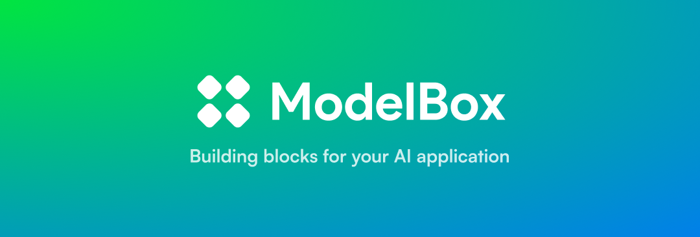

# ModelBox

We simplify the integration of AI capabilities, empowering developers to effortlessly build outstanding AI-enhanced applications.

# Getting Started

## [AI Kit](https://github.com/model-box/ai-kit)

AI Kit is a collection of ready-to-go Chat UI/API SDK to help you integrate AI capabilities into your applications. It is designed to be simple, easy to use, and customizable.

## [ModelBox](https://model.box)

The develope platform for AI developers to build, analyze, and optimize AI applications.

# Where to find us

Need help about ModelBox? We are happy to connect! Find us at the following platforms 👇 :

